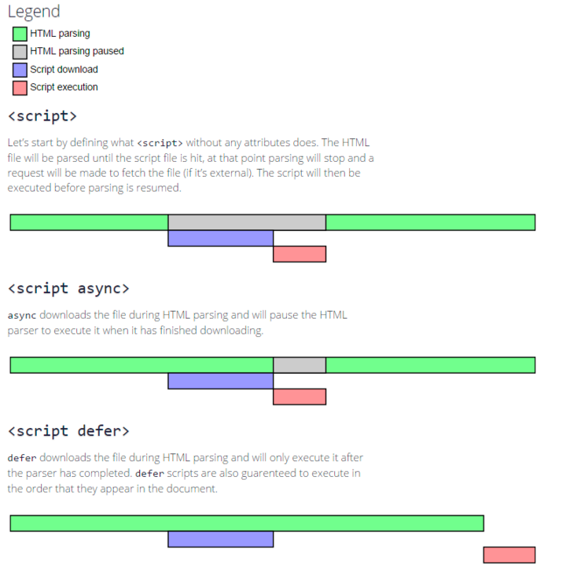

## HTML相关问题
## 先来试个一句话解释仨，当浏览器碰到 script 脚本的时候：
```js
<script src="script.js"></script>
```

没有 defer 或 async，浏览器会立即加载并执行指定的脚本，“立即”指的是在渲染该 script 标签之下的文档元素之前，也就是说不等待后续载入的文档元素，读到就加载并执行。

```js
<script async src="script.js"></script>
```

有 async，加载和渲染后续文档元素的过程将和 script.js 的加载与执行并行进行（异步）。

```js
<script defer src="myscript.js"></script>
```

有 defer，加载后续文档元素的过程将和 script.js 的加载并行进行（异步），但是 script.js 的执行要在所有元素解析完成之后，DOMContentLoaded 事件触发之前完成。

然后从实用角度来说呢，首先把所有脚本都丢到 </body> 之前是最佳实践，因为对于旧浏览器来说这是唯一的优化选择，此法可保证非脚本的其他一切元素能够以最快的速度得到加载和解析

蓝色线代表网络读取，红色线代表执行时间，这俩都是针对脚本的；绿色线代表 HTML 解析。

此图告诉我们以下几个要点：



defer 和 async 在网络读取（下载）这块儿是一样的，都是异步的（相较于 HTML 解析）
它俩的差别在于脚本下载完之后何时执行，显然 defer 是最接近我们对于应用脚本加载和执行的要求的
关于 defer，此图未尽之处在于它是按照加载顺序执行脚本的，这一点要善加利用
async 则是一个乱序执行的主，反正对它来说脚本的加载和执行是紧紧挨着的，所以不管你声明的顺序如何，只要它加载完了就会立刻执行
仔细想想，async 对于应用脚本的用处不大，因为它完全不考虑依赖（哪怕是最低级的顺序执行），不过它对于那些可以不依赖任何脚本或不被任何脚本依赖的脚本来说却是非常合适的，最典型的例子：Google Analytics
[](https://segmentfault.com/q/1010000000640869)

## V8垃圾回收机制
[V8垃圾回收机制](https://segmentfault.com/a/1190000025129635)

## 浏览器缓存机制
[缓存机制](https://www.cnblogs.com/suihang/p/12855345.html)
[浏览器缓存机制](https://www.jianshu.com/p/54cc04190252)

## 什么是盒子模型
在网页中，一个元素占有空间的大小由几个部分构成，其中包括元素的内容（content），元素的内边距（padding），元素的边框（border），元素的外边距（margin）四个部分。这四个部分占有的空间中，有的部分可以显示相应的内容，而有的部分只用来分隔相邻的区域或区域。4个部分一起构成了css中元素的盒模型

## 简述一下src与href的区别
href 是指向网络资源所在位置，建立和当前元素（锚点）或当前文档（链接）之间的链接，用于超链接。

src是指向外部资源的位置，指向的内容将会嵌入到文档中当前标签所在位置；在请求src资源时会将其指向的资源下载并应用到文档内，例如js脚本，img图片和frame等元素。当浏览器解析到该元素时，会暂停其他资源的下载和处理，直到将该资源加载、编译、执行完毕，图片和框架等元素也如此，类似于将所指向资源嵌入当前标签内。这也是为什么将js脚本放在底部而不是头部。

## cookie、localStorage、sessionStorage区别

| 特性 | cookie  | localStorage | sessionStorage |
|:--|:--|:--|:--|
| 由谁初始化 | 客户端或服务器，服务器可以使用Set-Cookie请求头。 | 客户端 |  客户端|
| 数据的生命周期 |一般由服务器生成，可设置失效时间，如果在浏览器生成，默认是关闭浏览器之后失效  |永久有效，可以被清除 | 关闭浏览器失效 |
| 存放数据大小 | 4KB | 5M | 5M |
| 与服务器通信 | 每次都会携带在HTTP头中，如果使用cookie保存过多数据会带来性能问题	 | 仅在客户端保存 | 仅在客户端保存 |
|  与服务器通信| 一般由服务器生成，用于标识用户身份 | 用于浏览器缓存数据 |用于浏览器缓存数据  |
|  访问权限| 任意窗口 | 任意窗口 | 当前页面窗口 |\

## 浏览器从输入URL到页面渲染的过程
https://juejin.cn/post/6984339284534755358
URL 输入
DNS 解析
建立 TCP 连接
发送 HTTP / HTTPS 请求（建立 TLS 连接）
服务器响应请求
浏览器解析渲染页面
HTTP 请求结束，断开 TCP 连接

## 移动端点击延迟 点击穿透
