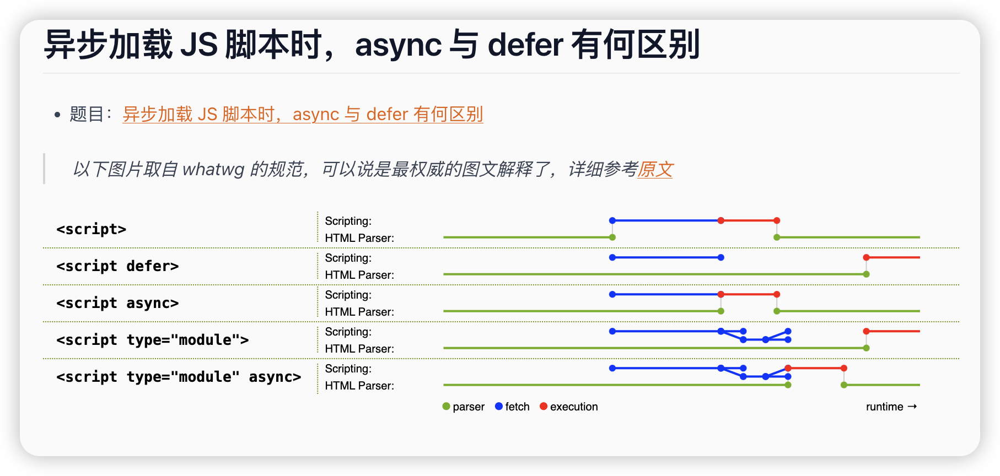

## html 知识剖析

### 网站开发中，如何实现图片的懒加载

#### 一、基本原理

> 触发条件：当图片进入用户可视区域（或接近可视区域）时，动态替换占位符为真实图片URL。

- 核心步骤：

:::tip
1.使用 data-src（或 data-srcset）属性存储真实图片地址。

2.检测图片是否进入视口，触发加载。

3.加载完成后替换占位符，显示真实图片。
:::

#### 二、实现方案

:::tip
1.原生 JavaScript + Intersection Observer API（推荐）

优势：高性能、低耦合，现代浏览器原生支持。
:::

```html

```

```js
// JavaScript
document.addEventListener("DOMContentLoaded", () => {
    const lazyImages = document.querySelectorAll(".lazyload");

    const observer = new IntersectionObserver((entries, observer) => {
        entries.forEach(entry => {
            if (entry.isIntersecting) {
                const img = entry.target;
                img.src = img.dataset.src; // 替换真实URL
                img.classList.remove("lazyload");
                observer.unobserve(img); // 停止观察已加载图片
            }
        });
    }, {
        rootMargin: "0px 0px 200px 0px", // 预加载200px外的图片
        threshold: 0.1 // 交叉比例阈值
    });

    lazyImages.forEach(img => observer.observe(img));
});
```

:::tip
2.传统滚动事件监听 + 节流

适用场景：兼容旧浏览器（如IE）
:::

```js
function lazyLoad() {
    const imgs = document.querySelectorAll('.lazyload');
    imgs.forEach(img => {
        const rect = img.getBoundingClientRect();
        if (rect.top < window.innerHeight + 200 && rect.bottom >= 0) {
            img.src = img.dataset.src;
            img.classList.remove('lazyload');
        }
    });
}

// 节流优化 + 初始化加载
const throttleLazyLoad = _.throttle(lazyLoad, 200);
window.addEventListener('scroll', throttleLazyLoad);
window.addEventListener('resize', throttleLazyLoad);
lazyLoad(); // 首次加载可见图片
```

:::tip
3.第三方库

- lozad.js：轻量级（<1KB），基于Intersection Observer。

- lazysizes：功能丰富，支持响应式图片、自动检测滚动等。
  :::

```html
<!-- 使用 lazysizes -->
<script src="lazysizes.min.js"></script>

```

### HTML 中有哪些语义化标签

:::tip
header
footer
main
aside
article
section
address
summary/details
menu
h1/h2/h3/h4/h5/h6
img
p
strong/italic
:::

# H5新特性：十个新特性

:::tip
一、语义标签

二、增强型表单

三、视频和音频

四、Canvas绘图

五、SVG绘图

六、地理定位

七、拖放API

八、WebWorker

九、WebStorage

十、WebSocket
:::

一、语义标签

html5语义标签，可以使开发者更方便清晰构建页面的布局

| 标签          | 描述                 |
|-------------|--------------------|
| `<header>`  | 定义了文档的头部区域         |
| `<footer>`  | 定义了文档的尾部区域         |
| `<nav>`     | 定义文档的导航            |
| `<section>` | 定义文档中的节            |
| `<article>` | 定义文章               |
| `<aside>`   | 定义页面以外的内容          |
| `<details>` | 定义用户可以看到或者隐藏的额外细节  |
| `<summary>` | 标签包含`details`元素的标题 |
| `<dialog>`  | 定义对话框              |
| `<figure>`  | 定义自包含内容，如图表        |
| `<main>`    | 定义文档主内容            |
| `<mark>`    | 定义文档的主内容           |
| `<time>`    | 定义日期/时间            |

二、增强型表单

html5修改一些新的input输入特性，改善更好的输入控制和验证

| 输入类型             | 描述             |
|------------------|----------------|
| `color`          | 主要用于选取颜色       |
| `date`           | 选取日期           |
| `datetime`       | 选取日期（UTC时间）    |
| `datetime-local` | 选取日期（无时区）      |
| `month`          | 选择一个月份         |
| `week`           | 选择周和年          |
| `time`           | 选择一个时间         |
| `email`          | 包含e-mail地址的输入域 |
| `number`         | 数值的输入域         |
| `url`            | url地址的输入域      |
| `tel`            | 定义输入电话号码和字段    |
| `search`         | 用于搜索域          |
| `range`          | 一个范围内数字值的输入域   |

html5新增了五个表单元素

| 标签           | 描述                      |
|--------------|-------------------------|
| `<datalist>` | 用户会在他们输入数据时看到域定义选项的下拉列表 |
| `<progress>` | 进度条，展示连接/下载进度           |
| `<meter>`    | 刻度值，用于某些计量，例如温度、重量等     |
| `<keygen>`   | 提供一种验证用户的可靠方法，生成一个公钥和私钥 |
| `<output>`   | 用于不同类型的输出，比如尖酸或脚本输出     |

html5新增表单属性

| 属性             | 描述                            |
|----------------|-------------------------------|
| `placeholder`  | 输入框默认提示文字                     |
| `required`     | 要求输入的内容是否可为空                  |
| `pattern`      | 描述一个正则表达式验证输入的值               |
| `min/max`      | 设置元素最小/最大值                    |
| `step`         | 为输入域规定合法的数字间隔                 |
| `height/width` | 用于`image`类型`<input>`标签图像高度/宽度 |
| `autofocus`    | 规定在页面加载时，域自动获得焦点              |
| `multiple`     | 规定`<input>`元素中可选择多个值          |  

### HTML 标签有哪些行内元素

:::tip
a
img
picture
span
input
textarea
select
label
:::

### 如何取消请求的发送

根据发送网络请求的API不同，取消方法不同

- xhr
- fetch
- axios


#### 001 XHR 使用 xhr.abort()

```js
const xhr = new XMLHttpRequest(),
  method = "GET",
  url = "https://developer.mozilla.org/";
xhr.open(method, url, true);
 
xhr.send();
 
// 取消发送请求
xhr.abort();
```
#### 002 fetch 使用 AbortController

```js
const controller = new AbortController()
const signal = controller.signal

const downloadBtn = document.querySelector('.download');
const abortBtn = document.querySelector('.abort');

downloadBtn.addEventListener('click', fetchVideo);

// 点击取消按钮时，取消请求的发送
abortBtn.addEventListener('click', function () {
    controller.abort();
    console.log('Download aborted');
});

function fetchVideo() {
// ...
    fetch(url, {signal}).then(function (response) {
    // ...
    }).catch(function (e) {
        // 请求被取消之后将会得到一个 AbortError
        reports.textContent = 'Download error: ' + e.message;
    })
}
```

#### 003 Axios: xhr 与 http/https

```js
const CancelToken = axios.CancelToken;
const source = CancelToken.source();

axios
        .get("/user/12345", {
          cancelToken: source.token,
        })
        .catch(function (thrown) {
          if (axios.isCancel(thrown)) {
            console.log("Request canceled", thrown.message);
          } else {
            // handle error
          }
        });

axios.post(
        "/user/12345",
        {
          name: "new name",
        },
        {
          cancelToken: source.token,
        },
);

// cancel the request (the message parameter is optional)
source.cancel("Operation canceled by the user.");
```

#### 在 Canvas 中如何处理跨域的图片

```js 
img.setAttribute("crossOrigin", "anonymous");
```

#### textarea 如何禁止拉伸

```css
textarea {
  resize: none;
}
```


### 什么是 HTML 的实体编码 (HTML Entity Encode)

:::tip
- 不可分的空格:＆nbsp;
- <(小于符号):＆lt;
- (大于符号):＆gt;
- ＆(与符号):＆amp;
- ″(双引号):＆quot;
- ‘(单引号):‘＆apos;
- ...
:::

HTML 实体是一段以连字号（&）开头、以分号（;）结尾的字符串。用以显示不可见字符及保留字符 (如 HTML 标签)

在前端，一般为了避免 XSS 攻击，会将 <> 编码为 &lt; 与 &gt;，这些就是 HTML 实体编码。

在 [whatwg]('https://html.spec.whatwg.org/multipage/named-characters.html#named-character-references) 中可查看实体编码数据。

在 HTML 转义时，仅仅只需要对六个字符进行编码: &, <, >, ", ', ```。可使用 [he]("https://npm.devtool.tech/he") 这个库进行编码及转义


```js
// 实体编码
he.encode('</img>')
"&#x3C;img src=&#x22;&#x22;&#x3E;&#x3C;/img&#x3E;"
 
// 转义
he.escape('</img>')
"&lt;img src=&quot;&quot;&gt;&lt;/img&gt;"
```


### 什么是 Data URL

#### Data URL是将图片转换为base64直接嵌入到了网页中，使用``这种方式引用图片，不需要再发请求获取图片。 使用Data URL也有一些缺点：

:::tip
- base64编码后的图片会比原来的体积大三分之一左右。
- Data URL形式的图片不会缓存下来，每次访问页面都要被下载一次。可以将Data URL写入到CSS文件中随着CSS被缓存下来。
:::


#### Data URL是前缀为data:协议的URL； 它允许内容创建者向文档中嵌入小文件，比如图片等。 Data URL由四部分组成：

:::tip
- 前缀data:
- 指示数据类型的MIME类型。例如image/jpeg表示JPEG图像文件；如果此部分被省略，则默认值为text/plain;charset=US-SACII
- 如果为非文本数据，则可选base64做标记
- 数据
:::

```html
data:[mediatype][;base63], data
```  

### HTML 中的 input 标签有哪些 type

:::warning
- button
- checkbox
- color
- date
- datetime-local
- email
- file
- hidden
- image
- month
- number
- password
- radio
- range
- reset
- search
- submit
- tel
- text
- time
- url
- week
:::

### 什么是重排重绘，如何减少重拍重绘

> 重排和重绘是关键渲染路径中的两步，可以参考另一个问题: [什么是关键渲染路径]("https://q.shanyue.tech/fe/engineering/391")

 - 重排(Reflow)：元素的位置发生变动时发生重排，也叫回流。此时在关键渲染路径中的 Layout 阶段，计算每一个元素在设备视口内的确切位置和大小。当一个元素位置发生变化时，其父元素及其后边的元素位置都可能发生变化，代价极高


 - 重绘(Repaint): 元素的样式发生变动，但是位置没有改变。此时在关键渲染路径中的 Paint 阶段，将渲染树中的每个节点转换成屏幕上的实际像素，这一步通常称为绘制或栅格化

> 另外，重排必定会造成重绘。以下是避免过多重拍重绘的方法

:::tip
- 1.使用 DocumentFragment 进行 DOM 操作，不过现在原生操作很少也基本上用不到
- 2.CSS 样式尽量批量修改
- 3.避免使用 table 布局
- 4.为元素提前设置好高宽，不因多次渲染改变位置
:::

### 如何计算白屏时间和首屏时间

计算白屏时间和首屏时间是前端性能优化的重要步骤，以下是具体方法：

#### 1. 白屏时间
白屏时间指从输入URL到页面开始显示内容的时间。

##### 计算方法：
- **Performance API**：
  ```javascript
  const whiteScreenTime = performance.timing.responseStart - performance.timing.navigationStart;
  console.log(`白屏时间：${whiteScreenTime}ms`);
  ```

- **手动打点**：
  在HTML头部插入JavaScript代码记录开始时间，在页面内容开始渲染时记录结束时间。
  ```html
  <head>
    <script>
      window.startTime = Date.now();
    </script>
  </head>
  <body>
    <div>页面内容</div>
    <script>
      const whiteScreenTime = Date.now() - window.startTime;
      console.log(`白屏时间：${whiteScreenTime}ms`);
    </script>
  </body>
  ```

#### 2. 首屏时间
首屏时间指从输入URL到首屏内容完全渲染的时间。

#### 计算方法：
- **Performance API**：
  ```javascript
  const firstScreenTime = performance.timing.domContentLoadedEventEnd - performance.timing.navigationStart;
  console.log(`首屏时间：${firstScreenTime}ms`);
  ```

- **手动打点**：
  在首屏内容底部插入JavaScript代码记录结束时间。
  ```html
  <head>
    <script>
      window.startTime = Date.now();
    </script>
  </head>
  <body>
    <div>首屏内容</div>
    <script>
      const firstScreenTime = Date.now() - window.startTime;
      console.log(`首屏时间：${firstScreenTime}ms`);
    </script>
  </body>
  ```

- **MutationObserver**：
  使用`MutationObserver`监听DOM变化，判断首屏内容是否渲染完成。
  ```javascript
  const startTime = Date.now();
  const observer = new MutationObserver(() => {
    if (document.querySelector('.first-screen-element')) {
      const firstScreenTime = Date.now() - startTime;
      console.log(`首屏时间：${firstScreenTime}ms`);
      observer.disconnect();
    }
  });
  observer.observe(document, { childList: true, subtree: true });
  ```

#### 总结
- **白屏时间**：`responseStart - navigationStart`
- **首屏时间**：`domContentLoadedEventEnd - navigationStart` 或通过手动打点和`MutationObserver`计算

### 简单介绍 requestIdleCallback 及使用场景

> requestIdleCallback 是一个浏览器 API，用于在浏览器的空闲时间执行 JavaScript 代码。它允许开发者在主线程不忙时执行任务，以避免阻塞用户交互或导致页面卡顿。

`requestIdleCallback` 是浏览器提供的一个 API，用于在浏览器空闲时执行任务，避免影响关键任务的执行，如动画或用户输入响应。

#### 功能
- **空闲时执行**：当主线程空闲时，执行回调函数。
- **超时机制**：可设置超时时间，确保任务在指定时间内执行。

#### 使用场景
1. **低优先级任务**：如日志记录、数据预取等。
2. **复杂计算**：如大数据处理、图像处理等。
3. **延迟加载**：如懒加载非关键资源。

#### 示例代码
```javascript
function doBackgroundWork(deadline) {
  while (deadline.timeRemaining() > 0) {
    // 执行任务
  }
  if (还有任务) {
    requestIdleCallback(doBackgroundWork);
  }
}

requestIdleCallback(doBackgroundWork);
```

#### 注意事项
- **任务拆分**：将大任务拆分为小块，避免长时间占用主线程。
- **超时设置**：合理设置超时时间，防止任务延迟过长。

#### 总结
`requestIdleCallback` 适合在浏览器空闲时执行低优先级任务，提升页面性能。

### 如何把 json 数据转化为 demo.json 并下载文件

json 视为字符串，可以利用 DataURL 进行下载

Text -> DataURL

除了使用 DataURL，还可以转化为 Object URL 进行下载

Text -> Blob -> Object URL

可以把以下代码直接粘贴到控制台下载文件

```js
function download(url, name) {
  const a = document.createElement("a");
  a.download = name;
  a.rel = "noopener";
  a.href = url;
  // 触发模拟点击
  a.dispatchEvent(new MouseEvent("click"));
  // 或者 a.click()
}
 
const json = {
  a: 3,
  b: 4,
  c: 5,
};
const str = JSON.stringify(json, null, 2);
 
// 方案一：Text -> DataURL
const dataUrl = `data:,${str}`;
download(dataUrl, "demo.json");
 
// 方案二：Text -> Blob -> ObjectURL
const url = URL.createObjectURL(new Blob(str.split("")));
download(url, "demo1.json");
```


### 在浏览器中如何获取剪切板中内容

在浏览器中获取剪切板内容可以通过 `Clipboard API` 实现。以下是具体方法：

---

#### 1. **使用 `navigator.clipboard.readText()`**
这是最常用的方法，用于读取剪切板中的文本内容。

#### 示例代码：
```javascript
navigator.clipboard.readText()
  .then(text => {
    console.log('剪切板内容:', text);
  })
  .catch(err => {
    console.error('无法读取剪切板内容:', err);
  });
```

#### 注意事项：
- **用户权限**：浏览器会要求用户授权，只有在用户允许后才能访问剪切板。
- **HTTPS 环境**：`Clipboard API` 仅在 HTTPS 或 `localhost` 环境下可用。
- **浏览器支持**：现代浏览器支持（Chrome、Edge、Firefox 等），但 Safari 支持有限。

---

#### 2. **使用 `document.execCommand('paste')`（已废弃）**
这是旧版方法，虽然部分浏览器仍支持，但已被废弃，不推荐使用。

#### 示例代码：
```javascript
const input = document.createElement('input');
document.body.appendChild(input);
input.focus();
document.execCommand('paste');
const clipboardText = input.value;
document.body.removeChild(input);
console.log('剪切板内容:', clipboardText);
```

#### 注意事项：
- **兼容性**：部分浏览器可能不支持。
- **安全性**：已被废弃，可能存在安全隐患。

---

#### 3. **处理图片或富文本内容**
如果需要读取剪切板中的图片或富文本内容，可以使用 `navigator.clipboard.read()`。

#### 示例代码：
```javascript
navigator.clipboard.read()
  .then(data => {
    for (const item of data) {
      if (item.types.includes('text/plain')) {
        item.getType('text/plain').then(blob => {
          const reader = new FileReader();
          reader.onload = () => {
            console.log('文本内容:', reader.result);
          };
          reader.readAsText(blob);
        });
      } else if (item.types.includes('image/png')) {
        item.getType('image/png').then(blob => {
          const img = document.createElement('img');
          img.src = URL.createObjectURL(blob);
          document.body.appendChild(img);
        });
      }
    }
  })
  .catch(err => {
    console.error('无法读取剪切板内容:', err);
  });
```

---

#### 4. **用户交互要求**
浏览器要求剪切板操作必须由用户触发（如点击事件），否则会抛出错误。

#### 示例代码：
```javascript
button.addEventListener('click', async () => {
  try {
    const text = await navigator.clipboard.readText();
    console.log('剪切板内容:', text);
  } catch (err) {
    console.error('无法读取剪切板内容:', err);
  }
});
```

---

#### 总结
- 推荐使用 `navigator.clipboard.readText()` 获取剪切板文本内容。
- 对于图片或富文本内容，使用 `navigator.clipboard.read()`。
- 确保操作由用户触发，并在 HTTPS 环境下使用。

## script标签里的async和defer有什么区别？



:::warning
当没有async和defer这两个属性的时候， 浏览器会立刻加载并执行指定的脚本

有async
**加载和渲染后面元素**的过程将和script的**加载和执行**并行进行（异步）

有defer
**加载和渲染后面元素**的过程将和script的加载并行进行（异步），但是它的执行事件要等所有元素解析完成之后才会执行
:::

## 语义化的理解。
在写HTML页面结构时所用的标签有意义
头部用head  主体用main  底部用foot...
怎么判断页面是否语义化了？
把CSS去掉，如果能够清晰的看出来页面结构，显示内容较为正常
为什么要选择语义化？
1.让HTML结构更加清晰明了
2.方便团队协作，利于开发
3.有利于爬虫和SEO
4.能够让浏览器更好的去解析代码
5.给用户带来良好的体验
2.H5C3有哪些新特性？

## H5的新特性：
1.语义化的标签
2.新增音频视频
3.画布canvas
4.数据存储localstorage sessionstorage
5.增加了表单控件 email url search...
6.拖拽释放API
CSS3的新特性：
1.新增选择器：属性选择器、伪类选择器、伪元素选择器
2.增加了媒体查询
3.文字阴影
4.边框
5.盒子模型box-sizing
6.渐变
7.过度
8.自定义动画
9.背景的属性
10.2D和3D

## rem是如何做适配的？
rem是相对长度，相对于根元素（html）的font-size属性来计算大小，通常来做移动端的适配
rem是根据根元素font-size计算值的倍数
比如html上的font-size:16px，给div设置宽为1.5rem,1.2rem = 16px*1.2 = 19.2px.

## 解决了哪些移动端的兼容问题？
1.当设置样式overflow:scroll/auto时，IOS上的华东会卡顿
-webkit-overflow-scrolling:touch;
2.在安卓环境下placeholder文字设置行高时会偏上
input有placeholder属性的时候不要设置行高
3.移动端字体小于12px时异常显示
应该先把在整体放大一倍，然后再用transform进行缩小
4.ios下input按钮设置了disabled属性为true显示异常
input[typy=button]{
opcity:1
}
5.安卓手机下取消语音输入按钮
input::-webkit-input-speech-button{
display:none
}
6.IOS下取消input输入框在输入引文首字母默认大写
<input autocapitalize='off' autocorrect='off'/>
7.禁用IOS和安卓用户选中文字
添加全局CSS样式：-webkit-user-select:none
8.禁止IOS弹出各种窗口
-webkit-touch-callout:none
9.禁止IOS识别长串数字为电话
添加meta属性 <meta conten='telephone=no' name='format-detection'>